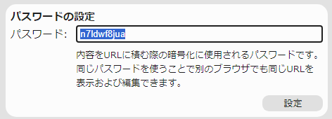
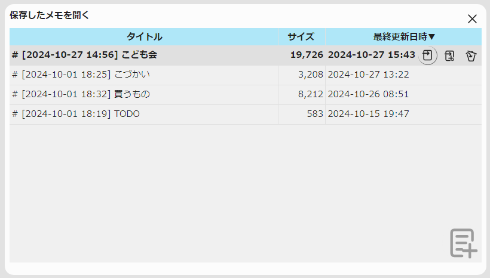
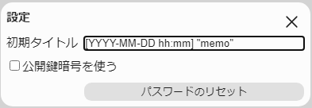

# メモがき

メモを書くためのHTMLです。


* Markdownぽい見た目のWYSWYGなエディターです。
* 単なるテキストエディターでは箇条書きなどの文字装飾がもの足りない人向け
* 内容はURLにハッシュとして積まれています。
  * ただし暗号化されているため、パスワードもしくは公開鍵が一致しなければ読み込めません。
* 編集した内容はブラウザに自動的に保存されます。

各アイコンは[SVG Repo](https://www.svgrepo.com)のものを参考にして作成しました。

## 使い方

GitHub Pagesに最新版がありますのでこちらをブックマークするなどしてお使いください。

[メモがき](https://sugoroku-y.github.io/memo/)

開くと最初にパスワードを設定するダイアログが開きます。



初期値としてランダム生成したパスワードが設定されていますので、ほかのPCとメモを共有しない場合にはそのままOKでもかまいません。

ほかのPCと共有したい場合にはパスワードを一致させる必要があるため覚えやすいパスワードを入力したり、ランダム生成されたパスワードをコピーしておくなど、メモを共有したいPCに同じパスワードを設定できるような準備が必要になります。

あとは文字を入力すればそのまま入力されますが、文字を修飾したい場合や構造を持たせたい場合にはそれぞれ操作する必要があります。

### 文字入力による修飾

* 行頭に`# `と書くことで見出し行になります。
  * `## `のように重ねることで見出しレベルが下がっていきます。
* 行頭に`- `と書くことで箇条書きになります。
  * 箇条書きの先頭で`[ ] `や`[x] `を入力するとチェックボックスになります。
* 行頭に`1. `と書くことで番号付きリストになります。
* 箇条書きや番号付きリストの項目内で行頭に`- `や`1. `と書くと1段下がった箇条書きや番号付きリストになります。
* ` ``` ` と書くことで文字装飾無しで書き込めるエリアが挿入されます
* `|||`と書くことでテーブルが挿入されます。
* `---`で水平線が挿入されます。

### キー操作による修飾

* 文字を選択して`*`を押すと強調になります。
  * さらに`*`を押すとより強い強調になります。
* 文字を選択して`` ` ``を押すとインラインコードになります。
* 文字を選択して`~`を押すと取り消し線になります。
* 選択していない状態でAltキーと一緒に上下のカーソルキーを押すと現在行をまるごと上下に移動させます。
* 選択していない状態でAltキー、Shiftキーと一緒に上下のカーソルキーを押すと現在行のコピーを挿入します。
* 箇条書き、番号付きリストの項目内にキャレットがあって選択していない状態でCtrlキーと一緒に`[`や`]`を押すと項目の階層が上下します。
* テーブルのセル内にキャレットがあるときに上下のカーソルキーを押すと同じ列の上下のセルにキャレットを移動します。
  * 下キーを押したときに下に行がない場合は下に行を追加します。
* テーブルのセル内にキャレットがあるときに左右のカーソルキーを押すと同じ行の左右のセルにキャレットを移動します。
  * 右キーを押したときに右に列がない場合は右に列を追加します。
* テーブルのセル内にキャレットがあるときにEnterキーを押すと次のセルにキャレットを移動します。
  * Enterキーを押したときに最後のセルだった場合にはテーブルの次にキャレットを移動します。

### メニュー操作

ウィンドウの右上にボタンがありマウスカーソルを持っていくと拡大します。


それぞれのボタンの機能は以下のとおり。

*  設定

  メモ書きについての設定を変更できます。

*  再読込

  メモ書きの新機能が追加されたときにクリックすると、新しい機能が使えるようになります。

*  エクスポート

  書かれたメモをMarkdownで記述したテキストを表示します。

  適宜選択してコピーするなどしてください。

*  インポート

  工事中

*  新しいメモを開く

  新規のメモを開きます。

*  保存したメモを開く

  今までに編集したメモを開きます。

#### 保存したメモを開く

`Ctrl+o`または`Alt+o`を押す、もしくはをクリックすると「保存したメモを開く」ダイアログが開きます。



今までに編集したメモは自動的に保存され、この一覧に並びます。

過去に編集したメモをもう一度開きたい場合には、上下のカーソルキーを押して開きたいメモを選択したあとスペースキーを押すか、開きたいメモをクリックすることで、そのメモを開きます。

今開いているタブとは別のタブで開く場合には、開きたいメモを選択したあと`Alt+Enter`を押すか、このボタンをクリックします。

変更されたメモは自動で保存されるため不要なメモも溜まっていきますので適宜削除してください。

削除したいメモを選択したあと`Delete`キーを押すか、このボタンをクリックすることで、そのメモを削除します。

保存されたメモに目的のものが見つからなければ、仕方ないので新しいメモを開きましょう。

`Alt+n`もしくは右下の方にあるこのボタンを押すと新しいメモを開きます。

#### 設定

を押すとこのアプリに関する設定ダイアログを開きます。



* 初期タイトル

    「新しいメモを開く」でタイトルとして使用されるテンプレートです。
    以下の文字列が置き換えられます。

    |置換前    | 置換後                                           |
    |------ | ----------------------------------------------|
    |`YYYY` | 西暦(4けた)                                       |
    |`YY`   | 西暦(下2けた)                                      |
    |`MMM`  | 月(英語省略表記)                                     |
    |`MM`   | 月(2けた0補完)                                     |
    |`M`    | 月                                             |
    |`DD`   | 日(2けた0補完)                                     |
    |`D`    | 日                                             |
    |`hh`   | 時(24時間制、2けた0補完)                               |
    |`h`    | 時(24時間制)                                      |
    |`mm`   | 分(2けた0補完)                                     |
    |`m`    | 分                                             |
    |`ss`   | 秒(2けた0補完)                                     |
    |`s`    | 秒                                             |
    |`SSS`  | 秒(小数点以下3けた)                                   |
    |`ddd`  | 曜日(英語省略表記)                                    |
    |`dd`   | 曜日(漢字1文字)                                     |
    |`"～"`  | ""を取り除いた文字列<br>※上記の文字を含む文字列を使用したい場合は""で囲んでください。|
    |その他の文字 | 上記以外の文字列はそのまま使用されます。                          |

* 公開鍵暗号を使う

  チェックをオンにするとパスワードを使う共通鍵暗号ではなく、公開鍵と秘密鍵を使って暗号化と復号を行う公開鍵暗号を内容の暗号化に使用します。
  公開鍵暗号ではパスワードを使わないため、他のマシンやブラウザなどでURLを共有する際に一手間必要になります(まだ用意されていません)

* パスワードのリセット

  共通鍵暗号で使用するパスワードをリセットします。メモを保存したときのパスワードと開くときに指定されるパスワードが違うと、読み込みに失敗しますので注意してください。

  このボタンは「公開鍵暗号を使う」のチェックがオンになっている場合は「公開鍵のリセット」になり、クリックすると公開鍵がリセットされます。
